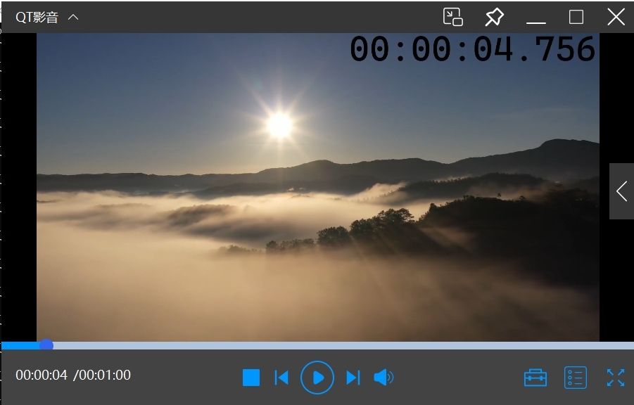

# QtPlayer

## 简介
使用 libvlc 解码渲染实现的windows播放器。

在 Windows 下使用 Visual Studio(5.15.2_msvc2019) 开发。

## Windows平台编译调试
libvlc 库下载地址 http://download.videolan.org/pub/videolan/vlc/

编译运行

使用 Visual Studio 打开 QtPlayer.vcxproj。

运行时需要将 libvlc.dll 和 libvlccore.dll， plugins/文件夹放入exe目录。

项目中使用了windows消息实现窗口移动，其它平台使用需要修改。